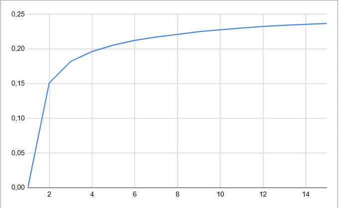
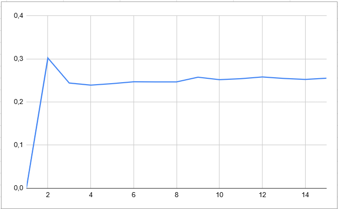

# NPPACR ````N Plus Proche Avrage Rapide```

## POC bitcoin all in all out

### concept:

ce poc permet d'essayer de déterminer le poucentage d'évolution moyen du prix du BTC à partir des performences passé en uttilisant le NPPACR. Il faut cependant bien garder à l'esprit que c'est un exemple, vous êtes libre d'adapter ce concept pour d'autre index.

Pour cela, nous uttilisation les valeurs maximal et minal sur une certaine periode de temps, puis nous essayons de deviner la valeur moyenne atteinte pendant une deuxième periode après la première. Pour que l'algorythme reconnaisse des paternes d'évolution et pas de prix, on normalise les valeurs pour obtenir des valeurs de prix entre 0 et 1 (0 étant la valeur minimal atteinte pendant la première periode et 1 la valeur maximal). Ainsi, la valeur d'évolution moyenne peut être superieur à 1 si elle est supperieur à la valeur maximal de la première periode et négatif si elle est inferieur à la valeur minimal de la première periode.

### disclamer:
Il faut garder à l'esprit qu'il n'existe pas d'algorythme magique qui peuvent prédire le court de la bourse, je fait cette algo pour le fun et pas pour gagner de l'argent.

### uttilisation:

premièrement, vous devez vous munir d'un CSV avec les données de votre index. Un exemple avec le BTC journalier entre le 01/01/2017 et le 07/09/2022 vous est fournit dans ce dépot  ```./content/data.csv```. 

Ensuite, vous devez parser ce CSV dans un fichier consommable par le programme C++. Pour cela vous pouvez utiliser le script python ```./csvParseur.py```. Vous pouvez paramètrer ce script via les varriables suivantes:

- NB_JOUR_AVANT     <- nombre de jour prix en compte pour deviner le pourcentage d'évolution
- NB_JOUR_ARPES     <- nombre de jour après ou l'on observe l'evolution moyenne
- csvFile           <- le chemin du fichier CSV
- savingFile        <- le chemin de sauvegarde du fichier parsé

une fois le fichier parsé, vous pouvez compiler le programe c++ avec la commande: ```g++ *.cpp -o output/a.exe``` puis lancer l'execution avec la commande ```./output/a.exe```. Vous pouvez également parametter le programe c++ en modifiant les varriables présant dans le fichier ```main.cpp```:

- csvFile   <- le chemin du fichier parsé
- nbCoord   <- le nombre de coordonné (2*NB_JOUR_AVANT dans le parseur python)
- nbVal     <- le nombre de valeur à inferer (1 dans notre cas)
- nbVoisin  <- le nombre de voisin à partir duquel on détermine l'évolution.

### precision de l'agorythme:

à l'aide de l'objet DataEvaluateur, vous pouvez déterminer l'erreur moyenne des prédictions de votre Frame à partir d'un nombre de voisin grâce à la fonction ````doYourJob(int nbVoisin)```.

Cependant, cette fonction ne retire pas le point que l'on essaye de deviner. Ainsi, si l'on choisi de ce baser sur 1 voisin, l'erreur est de zero. Ainsi, il ne faut pas uttiliser directement la valeur quel nous retourne mais retirer de cette valeur multiplié par le nombre de voisin, la somme des erreurs précédentes.

Après avoir fait le test avec les 2057 ```Point``` trouvé du fichier ```data.csv```, j'ai obtenu les deux graphique suivant: 


Ce graphique montre l'évolution de l'erreur moyenne en fonction du nombre de voisin.

Ce graphique montre également l'évolution de l'erreur moyenne en fonction du nombre de voisin en prenant cette fois ci en comtpe le fait qu'on ne retire pas les points de la Frame quand on essaye de deviner ça valeur. Dans cette exemple, le nombre de voisin idéale est 4, mais cette valeur peut augmenter si l'on augmente le nombre de point présent dans la frame. 
